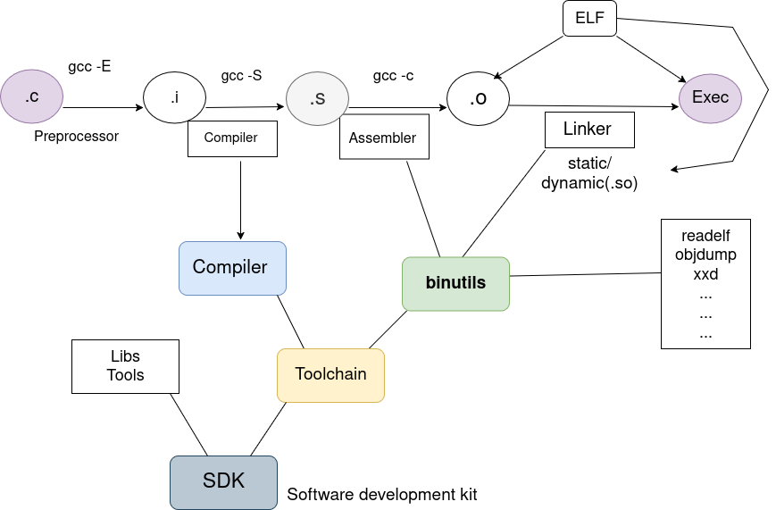

Preprocessor :

main.c -->main.i

Commands :


```bash
cpp main.c -o main.i
gcc -E main.c -o main.i

```
Compiler :
 main.i -->main.s 

Command :

```bash
gcc -S main.i

```
output :main.s (Assembly)

Assembler:

main.s -->main.o

Command:

```bash
gcc -c main.s
as main.s

```
main.o :Format ELF :Relocatable

Linker:

main.o -->Executable 

Command :
 
```bash
gcc file.c main.o -o main
```
main:Executable


