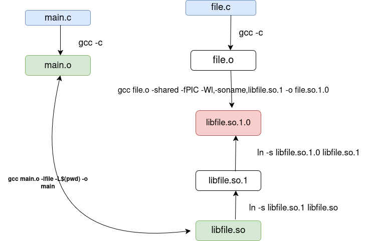

## Create shared object :
```bash
gcc file.o -shared libfile.so

```
gcc -->linker 

dynamic linking :

## Link between them :
```bash
gcc main.o -lfile -L$(pwd) -o main

```

we will find the functions undefined .

```bash
ldd main
        linux-vdso.so.1 (0x00007ffd33dc7000)
        libfile.so => not found
        libc.so.6 => /lib/x86_64-linux-gnu/libc.so.6 (0x000074b76b200000)
        /lib64/ld-linux-x86-64.so.2 (0x000074b76b469000)

```

### Loader will look :
This will make the library availabe at run-time:

###Environment varaible :
*LD_LIBRARY_PATH

export LD_LIBRARY_PATH=$(pwd)
unset LD_LIBRARY_PATH
 
### Cache (data base)
/etc/ld.so.conf, ld.so.conf.d/*.conf , ld.so.cache 

### Convention to prepare a shared library:

To create a shared library :

```bash
gcc file.c -shared -fPIC -Wl,-soname,libfile.so.1 -o libfile.so.1.0

```


so we can integrate it in cache .

but this file it can't be see by the linker and the loader :

so we need to create two symbolic link :

```bash
ln -s libfile.so.1  libfile.so.1.0
ln -s libfile.so.1 libfile.so

```

Add the path of shared library to the cache :


```bash
sudo nano /etc/ld.so.conf.d/file.conf

```

and add the path inside it .
and then run
``````bash
sudo ldconfig

```

 to update the cache.

To search for the shared library in the cache,  use the following command :


``````bash
ldconfig -p | grep libfile.so

```

#### Using RPATH:

``````bash
gcc main.o -lfile -L$(pwd) -Wl,-rpath=$(pwd) -o main

```
This method it not recommended for professional projects because it uses a  (RUNPATH=) local path


